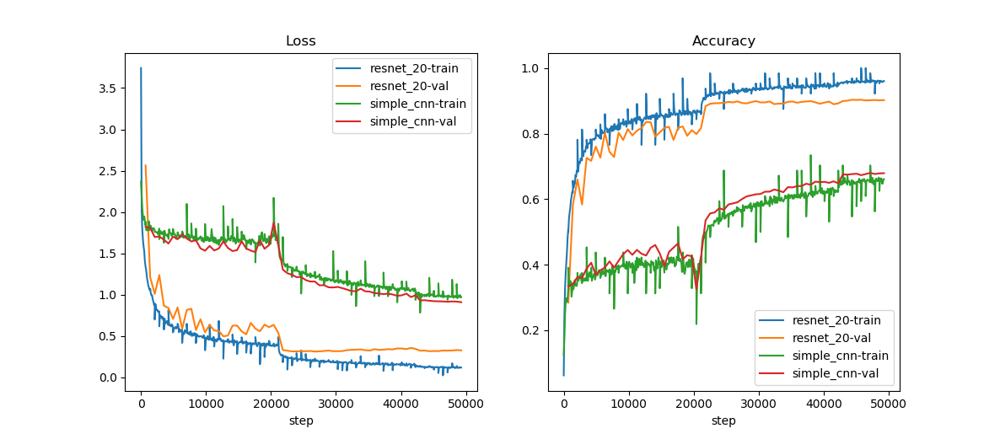

# Description
A simple demo for training cnn with pytorch. It is a pytorch clone of [tf-simple-example](https://github.com/blaueck/tf-simple-example). It support training cnn with mnist, cifar10, cifar100 and svhn.

# Requirement
* python==3.6
* pytorch>=1.0.0
* torchvision
* matplotlib (optional, for plot training logs)


# Run
```bash
# train
python train.py

# eval
python eval.py log/resnet_20/checkpoint_69.pk

# plot training logs
python plot_log.py log/ -m true
```

# Training Curve
